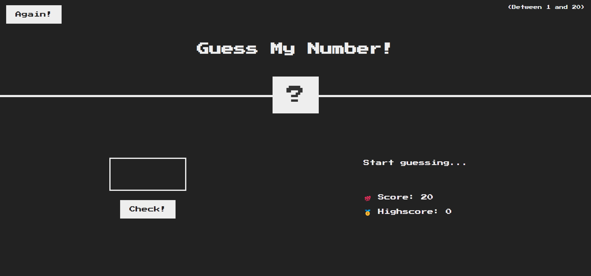
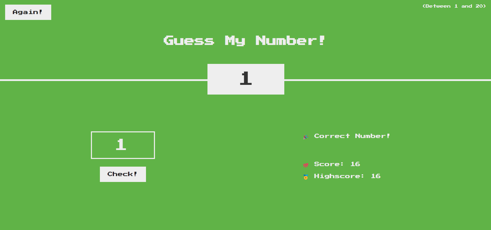

# Guess My Number Game

A simple and fun guessing game where you try to guess a randomly generated number between 1 and 20.

## Features

- **Interactive Gameplay:** Enter your guess and receive feedback on whether the number is too high, too low, or correct.
- **Score Tracking:** Your score starts at 20 and decreases with each incorrect guess. Try to beat your high score!

## How to Play

1. Open the `index.html` file in your browser.
2. Guess a number between 1 and 20 by entering it in the input field.
3. Click the "Check!" button to see if your guess is correct.
4. If your guess is correct, the background turns green, and your high score is updated if you achieved a new one.
5. If your guess is incorrect, you'll receive feedback whether the guess was too high or too low, and your score will decrease.
6. Click the "Again!" button to restart the game with a new number.

## Files

- `index.html`: The main HTML file that structures the game.
- `script.js`: The JavaScript file that contains the game logic.
- `style.css`: The CSS file for styling the game.

## Screenshots

The game starts!

Correct answer!

## Installation

To play the game:

1. Download or clone this repository.
2. Open the `index.html` file in your web browser.

## Technologies Used

- HTML5
- CSS3
- JavaScript (ES6)
